# Online Retail Analytics Project

An e-commerce analytics portfolio project based on a large event-level online retail dataset covering October and November 2019.

## Project Goal

This project demonstrates a full analytics workflow on large-scale e-commerce data:

- data quality review
- exploratory data analysis
- funnel and assortment analysis
- customer segmentation
- statistical validation of key findings
- business recommendations

## What This Repository Includes

- reproducible Python scripts for each analysis stage
- visualizations and summary charts
- business-focused conclusions for every analysis block
- RFM customer segmentation
- statistical testing for key hypotheses
- a single HTML dashboard with the final visuals and conclusions

## How To Review The Project

The best reading order is:

1. `README.md` for the project story and main findings
2. `analysis/output/*.png` for the visual results
3. `analysis/dashboard.html` for a single-page summary of the analysis
4. `analysis/*.py` for the reproducible code

For local review, the easiest file to open is:

- [analysis/dashboard.html](analysis/dashboard.html)

## Scope Completed

The project includes:

1. Data overview and data quality checks
2. Cleaning logic and dataset limitation review
3. Core EDA for revenue, trends, customers, products, and basket size
4. Category funnel analysis
5. Category and brand mix analysis
6. Category opportunity matrix
7. RFM segmentation
8. Statistical analysis of key hypotheses
9. Visual packaging into a single HTML dashboard

## Important Dataset Limitation

This is an **event-level** dataset, not an order-level dataset.

The data contains:

- `view`
- `cart`
- `purchase`

The data does not contain:

- `order_id`
- product quantity
- country or geography

Because of that:

- revenue is treated as a **purchase-value proxy**, not audited financial revenue
- basket size is measured at the **purchase-session proxy** level
- country analysis is **not possible** without an external geography field

## Tools Used

- `Python`
- `DuckDB`
- `Pandas`
- `Matplotlib`
- `Seaborn`
- `SciPy`

## Executive Summary

- November growth was driven mainly by **more purchasing users and more purchase events**, not by a higher ticket size.
- The portfolio is **highly concentrated**: `electronics.smartphone` accounts for `66.29%` of category revenue proxy.
- Brand concentration is also high: `Apple + Samsung = 67.31%` of brand revenue proxy.
- Most purchase sessions are **single-item**: average purchase session size is `1.18`, median is `1`.
- From a retention perspective, a large share of customer value sits in **Champions** and **Loyal Customers**, while **Cannot Lose Them** already requires dedicated retention action.
- Statistical tests confirm that:
  - smartphones convert materially better than the rest of the catalog
  - November has a different price mix than October
  - Apple operates in a significantly more premium price tier than Samsung

## Main Findings

### 1. Revenue Distribution

- purchase events analyzed: `1,659,788`
- revenue proxy: `505.2M`
- average purchase price: `304.35`
- median purchase price: `174.02`

Interpretation:

- the distribution is strongly right-skewed
- a meaningful share of value comes from higher-priced items
- the business is not driven by a flat mix of low-value orders; premium products materially shape performance

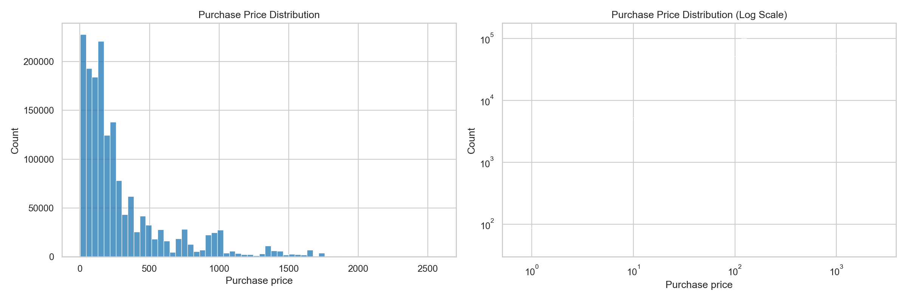

### 2. Monthly Trend

- October revenue proxy: `229.96M`
- November revenue proxy: `275.19M`
- month-over-month growth: about `19.7%`

Interpretation:

- November growth came mainly from a broader buyer base and more purchase activity
- average purchase price declined slightly, so the uplift was volume-driven rather than ticket-driven

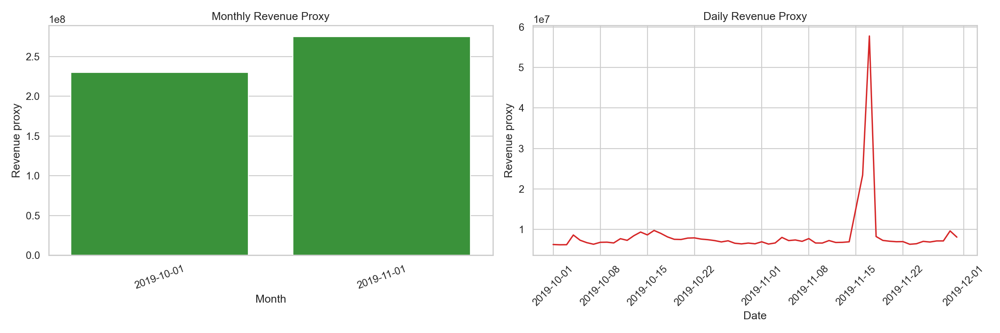

### 3. Top Customers

Interpretation:

- a relatively small group of customers appears to generate very high value
- this strongly supports the use of RFM and customer-value segmentation
- some of the top customers may reflect reseller or business-like behavior

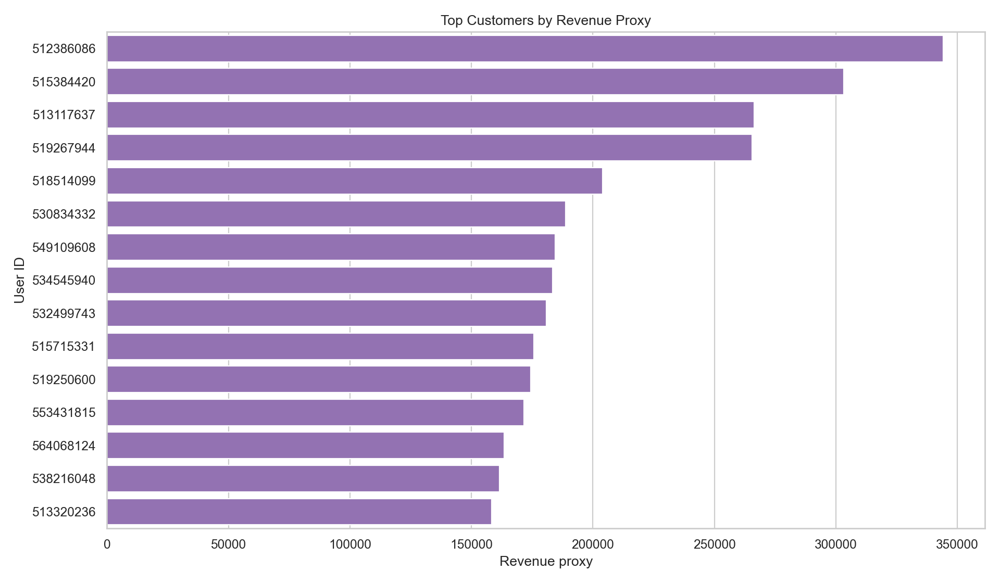

### 4. Top Products

Interpretation:

- the top products are dominated by Apple and Samsung smartphones
- revenue is concentrated around a narrow set of hero SKUs
- this is commercially powerful, but risky from an assortment dependency perspective

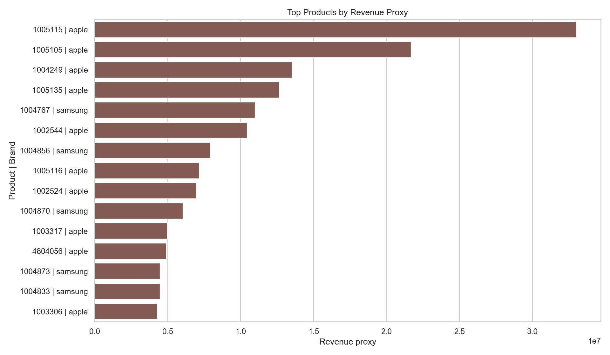

### 5. Basket Size

- average items per purchase session: `1.18`
- median items per purchase session: `1`

Interpretation:

- most purchase sessions are single-item
- cross-sell and bundling appear underdeveloped
- this may reflect either a high-consideration catalog or missed merchandising opportunities

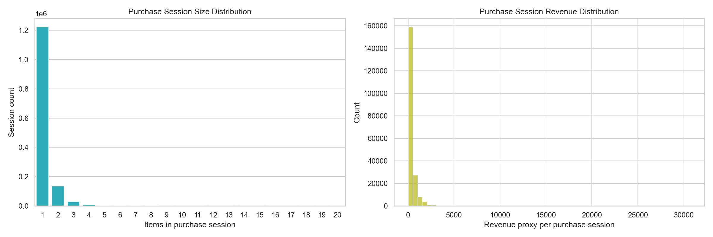

### 6. Category Conversion Funnel

Interpretation:

- some categories combine high traffic with strong conversion
- `electronics.smartphone` is especially important because it combines large traffic volume with strong purchase intent
- high-traffic, low-conversion categories represent the biggest short-term optimization opportunity

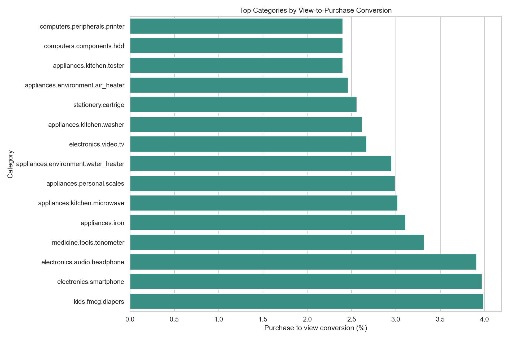

### 7. Category Revenue Mix

- `electronics.smartphone` contributes `66.29%` of category revenue proxy

Interpretation:

- the portfolio depends heavily on the smartphone category
- this is the main commercial engine, but also a major concentration risk

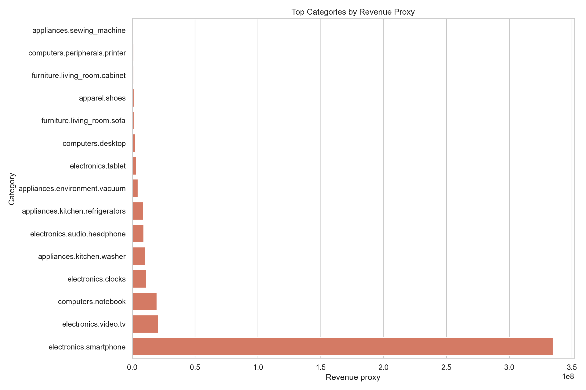

### 8. Brand Revenue Mix

- `Apple`: `47.26%`
- `Samsung`: `20.05%`
- combined: `67.31%`

Interpretation:

- brand concentration is very high
- supplier dependency and brand concentration are important strategic risks

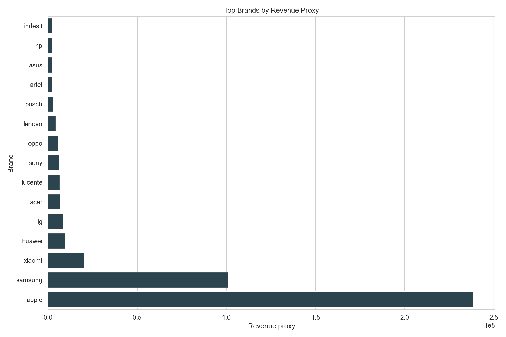

### 9. Category Opportunity Matrix

Interpretation:

- the core portfolio sits in the **High Traffic / High Conversion** quadrant
- categories such as `computers.desktop`, `furniture.living_room.sofa`, and `apparel.shoes` stand out as optimization targets
- categories such as `appliances.environment.air_conditioner` and `electronics.camera.photo` look like underexposed niche opportunities

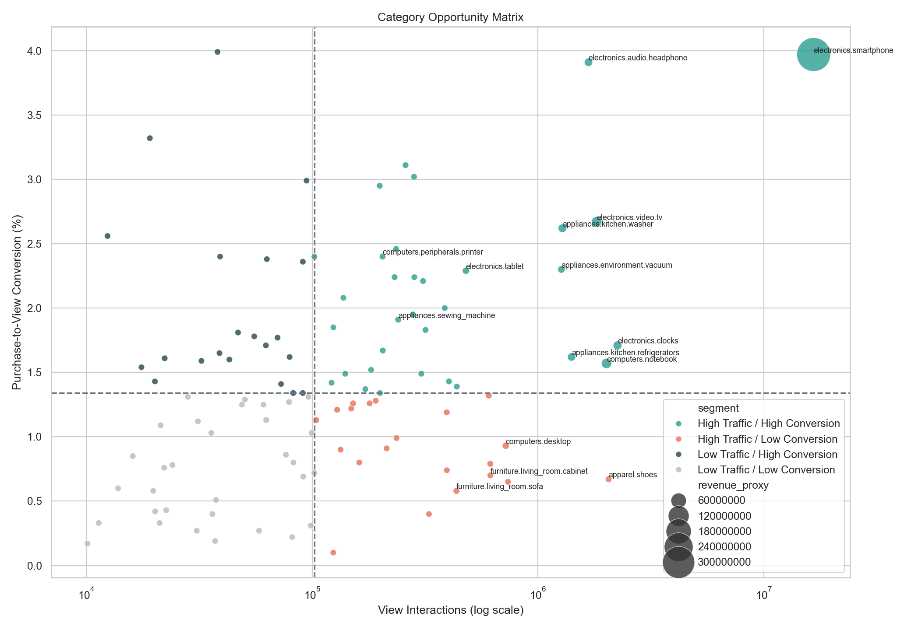

### 10. RFM Segmentation

- `Champions`: `96,004` customers, `42.39%` revenue share
- `Loyal Customers`: `67,963` customers, `14.74%` revenue share
- `Cannot Lose Them`: `48,511` customers, `16.03%` revenue share
- `Potential Loyalists`: `128,038` customers, `8.08%` revenue share

Interpretation:

- nearly half of total value is concentrated in `Champions`
- `Cannot Lose Them` already represents too much value to ignore from a retention standpoint
- `Potential Loyalists` are the best audience for CRM, personalization, and repeat-purchase growth

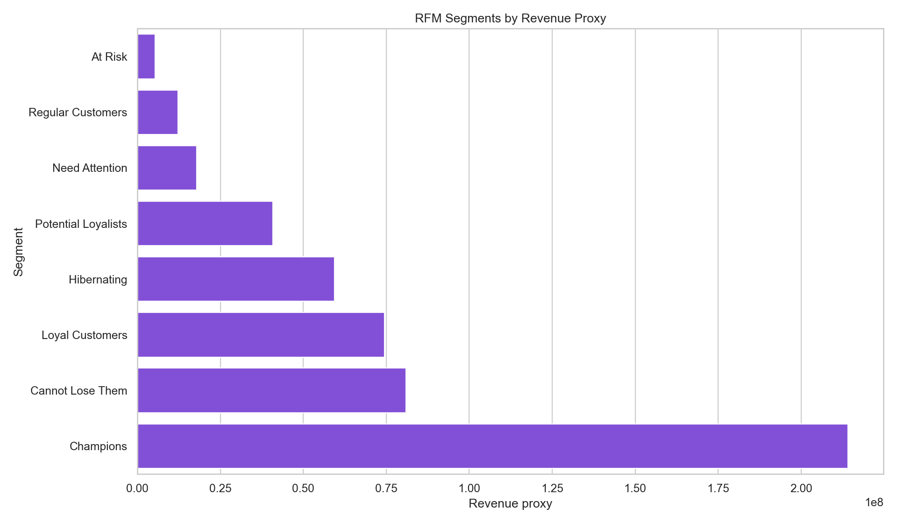
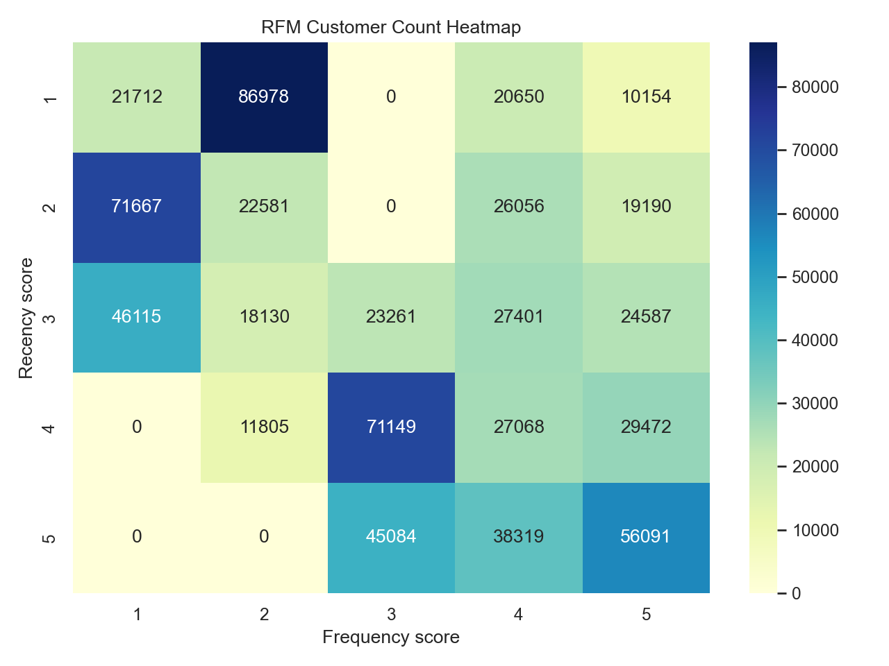

### 11. Statistical Analysis

Tested hypotheses:

- November vs October purchase price distribution
- smartphone conversion vs the rest of the catalog
- Apple vs Samsung purchase price distribution

Results:

- median November purchase price is about `5.49%` lower than October
- `electronics.smartphone` converts to purchase about `132.59%` better than the rest of the catalog
- Apple median purchase price is about `231.94%` higher than Samsung

Interpretation:

- smartphone strength is not just a visual pattern; it is statistically stronger than the rest of the catalog
- November growth came with a cheaper price mix
- Apple functions as a premium price engine in the portfolio

Important note:

- with a dataset this large, even small differences can become statistically significant
- business meaning should therefore be judged with **uplift, median differences, and concentration**, not p-values alone

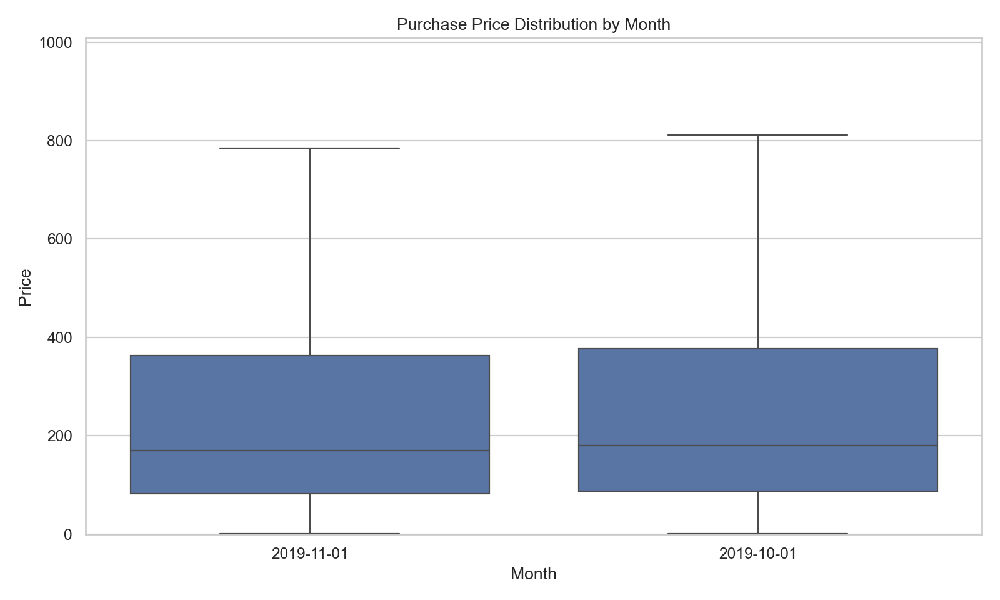
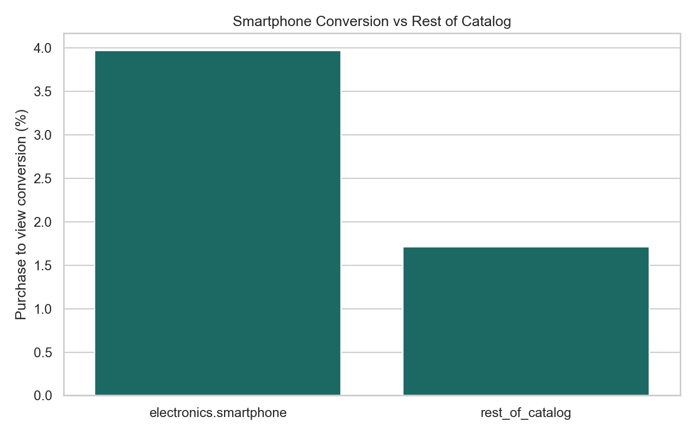
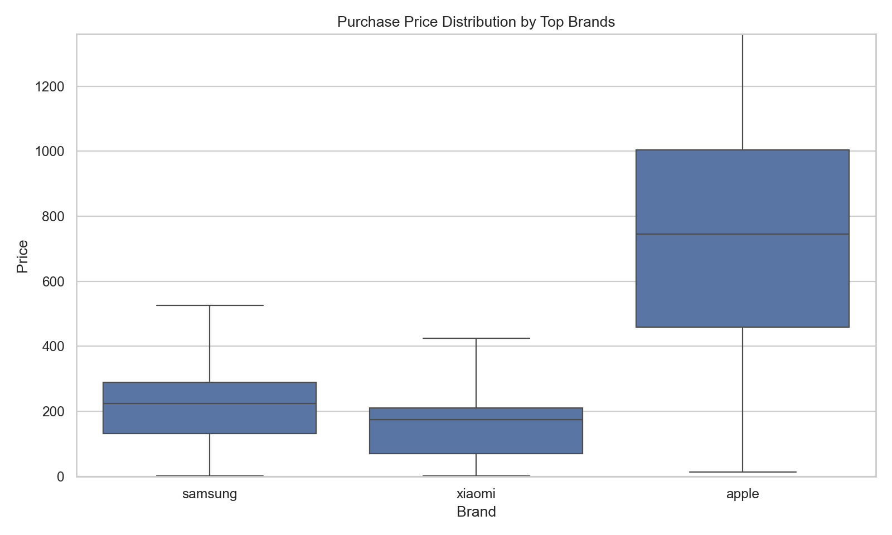

## Final Business Recommendations

1. Protect the smartphone category as the main revenue engine through stock, pricing, product page quality, and promotional priority.
2. Reduce concentration risk over time by developing additional growth pockets outside smartphones and outside Apple/Samsung.
3. Prioritize high-traffic, low-conversion categories as the main source of near-term performance uplift.
4. Improve cross-sell and bundling because the current basket pattern is heavily single-item.
5. Build retention strategies by RFM segment:
   - protect `Champions` and `Loyal Customers`
   - convert `Potential Loyalists` into repeat purchasers
   - win back `Cannot Lose Them` and `At Risk` customers with targeted campaigns
6. Add geography and order-level data in the next phase if the goal is true market expansion analysis or real basket economics.

## Project Limitations

- the dataset covers only `October–November 2019`
- there is no `country`
- there is no `order_id`
- there is no `quantity`
- revenue in this project is an analytical proxy, not financial reporting

These limitations do not invalidate the project, but they are essential for correct interpretation.

## Project Structure

```text
analysis/
  step01_data_audit.py
  02_eda.py
  03_funnel_mix_eda.py
  04_category_opportunity_matrix.py
  05_rfm_segmentation.py
  06_statistical_analysis.py
  dashboard.html
  output/
README.md
requirements.txt
```

## How To Reproduce

1. Create a virtual environment
2. Install the dependencies
3. Place the source CSV files in the project root with these names:
   - `2019-Oct.csv`
   - `2019-Nov.csv`
4. Run the scripts stage by stage from the `analysis` folder

```bash
python3 -m venv .venv
source .venv/bin/activate
pip install -r requirements.txt
python analysis/step01_data_audit.py
python analysis/02_eda.py
python analysis/03_funnel_mix_eda.py
python analysis/04_category_opportunity_matrix.py
python analysis/05_rfm_segmentation.py
python analysis/06_statistical_analysis.py
```

## HTML Dashboard

All key visuals and concise business conclusions are collected in:

- [analysis/dashboard.html](analysis/dashboard.html)

## Not Included In The Repository

Because of file size, the repository does not include:

- `2019-Oct.csv`
- `2019-Nov.csv`
- `online_retail.duckdb`
- `.venv`
